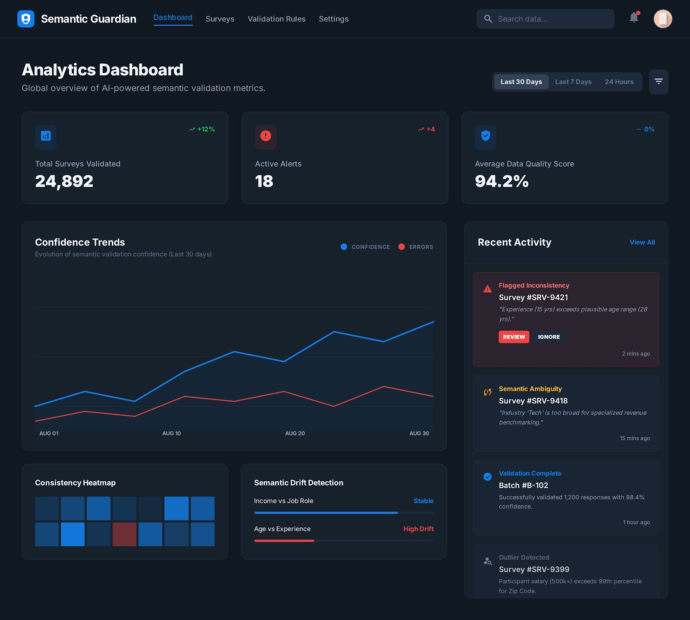
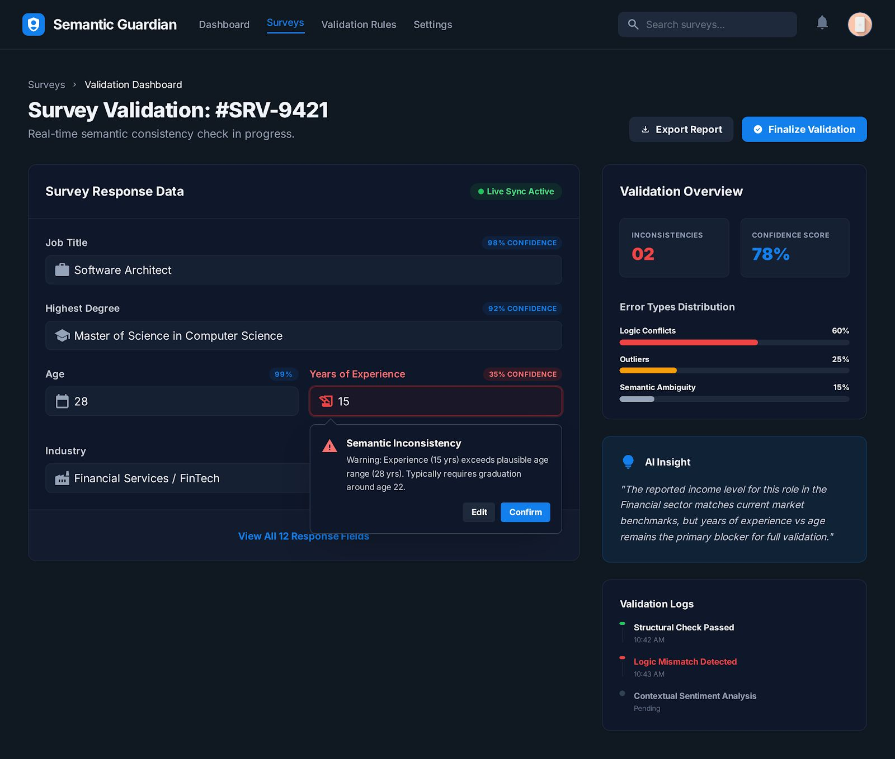
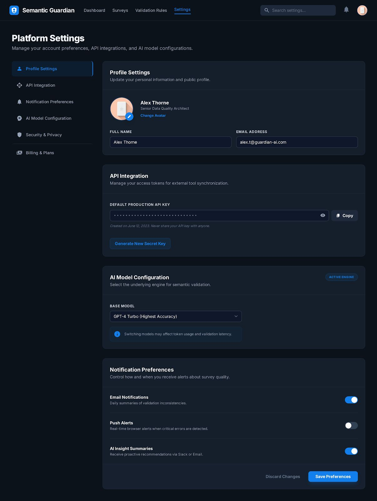

# Semantic Guardian – Smart Survey Validation Prototype

Semantic Guardian is a prototype system designed to improve the quality of survey data by detecting logical and semantic inconsistencies in real time.
Instead of relying only on static validation rules, the system simulates an intelligent assistant that evaluates answers contextually and provides alerts when contradictions appear.

---

## Dashboard Interface

The **Dashboard** provides a central overview of the system’s performance. It visualizes key indicators such as detected inconsistencies, confidence scores, and overall validation activity. This interface helps administrators quickly understand the status of incoming survey data and monitor potential issues.

---

## Surveys Interface

The **Surveys** page represents the environment where survey responses are submitted. Users fill in different fields such as profession, education level, age, and experience. The system continuously monitors the inputs and prepares them for validation through the semantic checking engine.

---

## Validation Rules Interface

The **Validation Rules** interface displays the logical conditions used to identify inconsistent answers. These rules simulate the reasoning layer of the intelligent validator, checking relationships between fields such as job titles and qualifications, age and experience, or marital status and number of children.

---

## Settings Interface

The **Settings** interface allows administrators to configure system parameters. Through this page, validation thresholds, rule behavior, and alert sensitivity can be adjusted. This flexibility allows the system to be adapted to different survey environments and institutional requirements.

---

## Project Goal

The goal of this prototype is to demonstrate how intelligent validation can improve survey data reliability by identifying inconsistencies during data entry rather than after data collection. This approach helps organizations reduce data cleaning efforts and increase trust in analytical results.
